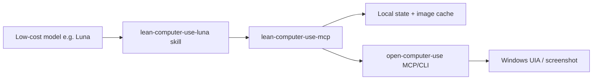

# lean-computer-use-mcp

Low-context, state-safe MCP facade over [Open Computer Use](https://github.com/iFurySt/open-codex-computer-use) for inexpensive agent models such as GPT-5.6 Luna.

## Install

```sh
pip install "git+https://github.com/Kvxw1105/lean-computer-use-mcp"
# or, without a checkout:
uvx --from "git+https://github.com/Kvxw1105/lean-computer-use-mcp" lean-computer-use serve --fake
```

Windows prerequisites (runtime only, not needed to install):

- `open-computer-use` **0.3.1** (npm global) on PATH; `doctor` reports when it
  is missing or drifts from the pin.
- Optional vision endpoints in `~/.lean-cu/config.json` for the OCR -> LLM
  visual fallback (`lean-computer-use config` / `config-ui`).

See [docs/PACKAGING.md](docs/PACKAGING.md) for MCP registration, skill
packaging, and the release-gate benchmark matrix.

> Status: **v0.2.0** (pinned upstream `0.3.1`). Phase-2 is complete: `cu_window`
> with occlusion/ambiguity handling, real-input facade fallback with structured
> errors, extended `doctor`, screenshot-fingerprint stale gate for trivial-tree
> apps, replay auto-recovery, IME + drag recording, and text-LLM ProviderPool
> failover. Release gates (success-rate matrix, upstream fixture pin) run in CI;
> **472 tests pass (1 skipped)** and ruff is clean. The real-machine checklist
> (docs/VERIFICATION.md) ran on a live Windows desktop on 2026-08-11: 7/10
> items pass (install/observe, doctor, drag recording, real-input fallback,
> window ambiguity/occlusion, screenshot-fingerprint stale gate, metrics
> honesty); 3 need a human at the keyboard (IME pinyin composition, replay
> stale-injection, cross-app chain). Verification found and fixed two bugs:
> GBK/UTF-8 upstream output decoding and image-bytes metric semantics.
> The package builds (`uv build`) but is **not yet published to PyPI**, and is
> not yet recommended for production use.

## Why this project exists

Open Computer Use works, but every snapshot includes a screenshot and every action returns a full refreshed UI state. On Windows we measured:

| Payload | Size |
|---|---:|
| Default `get_app_state` tree text | ~54,000 characters |
| Compact `READ` tree text | ~2,300 characters |
| Screenshot (Base64) | ~405,000 characters, unchanged between presets |

A skill can reduce how often a model observes, but it cannot remove screenshots, action-returned full states, or duplicated tool schemas from the model's context. This project puts a bounded proxy between the model and the upstream server so the model sees only what it needs to complete the task.

Measured on the real desktop (ChatGPT window, 2026-08-05): the default upstream
snapshot costs ~437,779 model-visible characters (55,543 text + 382,236 image
Base64) and 460 nodes; the facade's `cu_observe` returns an 820-character
payload with 3 controls and no image, a **99.8% reduction in model-visible
context**. See [docs/BENCHMARKS.md](docs/BENCHMARKS.md) for the full table and
reproduction commands.

## Procedural memory (atomic components)

Beyond whole-task replay, `compile --library` and `recall` learn **atomic
components** (e.g. `jianying::click::button::font-size`) and task templates,
then compose new tasks from old building blocks. Replay feeds results back:
successes raise popularity and teach effects, failures raise staleness.
`refine` lets the model curate the library (aliases, merges, descriptions,
template generalizations) with a human-reviewed apply step. `compile --llm`
names coordinate-only steps semantically (crucial for UIA-thin apps such as
JianYing), and `recall --llm` maps Chinese or English intents onto learned
components - measured 72.6% lower model-visible context on the second run of
the same task (see [docs/BENCHMARKS.md](docs/BENCHMARKS.md) E12).
See [docs/MEMORY.md](docs/MEMORY.md).

## Record & Replay

Demonstrate a workflow once, then replay it with far less context:

```sh
lean-computer-use record --app JianYing --out recordings/font-size.json
lean-computer-use compile --in recordings/font-size.json --out-dir skills/recorded/subtitle-font-size
lean-computer-use replay --in recordings/font-size.json --run
```

The recorder captures mouse/keyboard events plus periodic element snapshots
(no screenshots), compiles an editable, intent-based `SKILL.md` (like the
official macOS-only Codex Record & Replay), and replay re-locates targets in
the live tree - coordinates are only a fallback for custom-rendered UIs.
See [docs/RECORDING.md](docs/RECORDING.md).

## Architecture



The facade owns:

- compact, query-relevant accessibility output instead of full trees;
- `state_id`-based freshness and stale-state rejection;
- local screenshot caching and on-demand cropping;
- delta summaries after actions instead of full refreshed states;
- per-call metrics for honest before/after cost measurement.

## Repository layout

```text
docs/            DESIGN, PROTOCOL, SECURITY, BENCHMARKS
src/             Python MCP server (incl. record/compile/replay CLI)
tests/           unit tests and fixtures
skills/          Codex skill that drives the facade
benchmarks/      benchmark scenario definitions
config/          example agent configuration
```

## Visual API configuration (GUI)

Non-technical users can manage vision endpoints (base URL / key / model,
multi-channel failover) in a browser:

```sh
lean-computer-use config-ui
```

It opens a local Chinese panel at `http://127.0.0.1:<port>/?t=<token>`: add,
remove, reorder and test endpoints, then save to `~/.lean-cu/config.json`
(keys are masked, stored only on your machine). A terminal equivalent exists:
`lean-computer-use config list|add|remove|reorder|test`. Environment variables
(`LEAN_CU_VISION_PROVIDERS` etc.) remain a temporary override when set.

## Development

```sh
git clone https://github.com/Kvxw1105/lean-computer-use-mcp.git
cd lean-computer-use-mcp
uv sync --all-extras
uv run pytest
```

Run a demo server with a fake upstream client (no desktop access):

```sh
uv run lean-computer-use serve --fake
```

## Documentation

- [Handoff](docs/HANDOFF.md)
- [Design](docs/DESIGN.md)
- [Protocol](docs/PROTOCOL.md)
- [Security](docs/SECURITY.md)
- [Benchmarks](docs/BENCHMARKS.md)

## License

MIT
