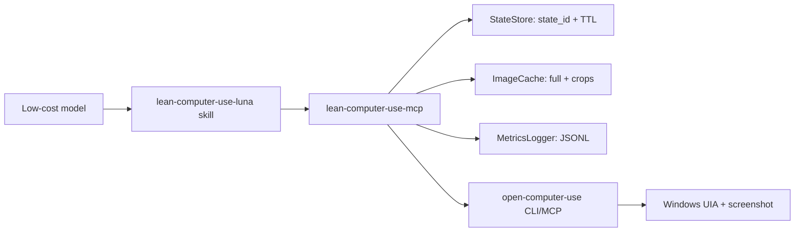

# Design

Status: M1 complete; V1 (vision skeleton) landed. This document defines the target system; implementation is intentionally incremental.

## 1. Problem

Open Computer Use gives agents reliable Windows control through accessibility and screenshots. It works, but it was not designed for small-context or low-cost models:

- Every `get_app_state` returns a screenshot plus a large accessibility tree.
- Every action returns a refreshed snapshot with the server's default tree budget, not the caller's compact budget.
- Tool schemas are duplicated across nine tools and are loaded regardless of task.
- There is no freshness token, so a model can act on indices that no longer mean the same thing.
- There is no measurable contract for how much context a task consumed.

Measured on Windows (ChatGPT window):

| Payload | Model-visible size |
|---|---:|
| Default `get_app_state` | ~54,000 chars text + ~405,000 chars Base64 image |
| Compact `READ` (`160/10/600`) | ~2,300 chars text + ~405,000 chars Base64 image |
| Compact `CONTROL` (`80/8/160`) | ~1,571 chars text + ~405,000 chars Base64 image |

Reducing tree limits does not reduce screenshot cost. This is an upstream runtime property and cannot be fixed by a skill.

## 2. Goals

- Reduce model-visible context per successful task by at least 60% compared with using the upstream tools directly.
- Keep success rate within 3 percentage points of the upstream baseline.
- Eliminate stale-index actions through a `state_id` protocol enforced by the facade.
- Provide honest per-task metrics so cost claims are verifiable.
- Keep a skill layer on top for confirmation policy, budgets, and retry discipline.

## 3. Non-goals

- Not a replacement for UI Automation or screenshot capture.
- Not a general desktop-automation framework.
- Not a payment/confirmation system; user confirmation remains a model/user policy decision.
- No macOS/Linux support in M0. The protocol is designed to be portable, but only the Windows upstream client is in scope initially.

## 4. Architecture

### Component responsibilities

| Component | Responsibility |
|---|---|
| `lean-computer-use-luna` skill | Task classification, confirmation, budgets, retry matrix, compact replies |
| `server.py` | Exposes `cu_*` tools to the agent |
| `upstream/` | Talks to `open-computer-use`; fake client for tests/demos |
| `parse/` | Turns upstream tree text into `ControlNode` objects |
| `state/` | Holds snapshots, fingerprints, TTL, stale rejection |
| `diff/` | Computes compact before/after deltas |
| `media/` | Caches full screenshots locally, crops on demand |
| `metrics/` | Appends one JSONL record per call, aggregates summaries |
| `vision/` | OCR/grounding fallback for UIA-blind apps; emits compact text element tables (see [VISION.md](VISION.md)) |

## 5. Tool surface

Four tools plus metrics. Keeping the surface small also reduces fixed schema cost.

- `cu_find_app(query?)` — running apps with visible windows only.
- `cu_observe(app, intent?, output_mode?, include_screenshot?, max_results?, preset?)` — compact state read.
- `cu_act(app, state_id, action, ...)` — one bounded action with stale-state rejection.
- `cu_batch(app, state_id, steps, max_actions?, fail_fast?)` — bounded, fail-fast sequence.
- `cu_metrics()` — aggregate counters for the current process.

Detailed schemas and examples live in [PROTOCOL.md](PROTOCOL.md).

## 6. State protocol

Every observation or action returns a new `state_id`.

- The facade keeps one current snapshot per app, with a configurable TTL (default 30 seconds).
- An action must include the `state_id` it was planned against.
- If the state is missing, expired, or not current, the facade returns `STALE_STATE` with the current `state_id` and a compact reason. It never guesses an element.
- Before executing, the facade takes one live read at the snapshot's budget and compares fingerprints; a changed tree rejects with `STALE_STATE` before any action runs (implemented in M1).
- Any navigation, modal, focus change, or action-returned snapshot invalidates the previous state for that app.

This protocol moves safety from a prompt-level rule to an enforceable server-side rule.

## 7. Context cost controls

1. **Top-K controls**: parse the upstream tree locally, filter unnamed/container nodes, rank by intent match, return at most `max_results` controls (default 20).
2. **Screenshot gate**: the facade stores the full screenshot locally. It forwards image data only when `include_screenshot=true` or `output_mode="visual"`.
3. **On-demand crop**: when a visual is required, crop to the target window/control frame instead of sending the full desktop.
4. **Delta after actions**: `cu_act` returns window-title change, focused element, added/removed/changed controls, and modal detection — not a full refreshed tree.
5. **Metrics**: every call records text characters, image bytes, node count, latency, and error type so improvements are measured.

## 8. Safety model

- The facade enforces freshness and action limits; it never manufactures user confirmation.
- `cu_batch` has a hard `max_actions` (default 3, enforced server-side).
- Commit-like actions are one-shot: on timeout or ambiguity the facade returns `COMMIT_UNCERTAIN` and never retries automatically.
- `type_text`/`press_key` are allowed only when the latest state proves focus; the facade rejects them without a focus field in the protocol.
- On-screen UI text is untrusted data. No protocol rule can be overridden by visible instructions.

Full details in [SECURITY.md](SECURITY.md).

## 9. Error taxonomy

| Error | Meaning | Recovery |
|---|---|---|
| `APP_NOT_FOUND` | No matching running app with a visible window | Ask user or run `cu_find_app` |
| `STALE_STATE` | Missing/expired/non-current state | Run `cu_observe` and re-plan |
| `ELEMENT_NOT_FOUND` | Target absent from latest state | Re-observe; escalate preset once |
| `AMBIGUOUS_TARGET` | Multiple matches, no unique target | Ask user; never pick first silently |
| `UNSUPPORTED_ACTION` | Action not allowed by facade policy | Change action or stop |
| `UPSTREAM_ERROR` | Upstream call failed | Report exact error; no blind retry |
| `COMMIT_UNCERTAIN` | Commit-like action timed out or ambiguous | Never retry automatically; new confirmation |

## 10. Acceptance metrics

- Median model-visible context per successful task reduced by at least 60%.
- Success rate no more than 3 percentage points below upstream baseline.
- Zero wrong-window actions and zero unconfirmed actions.
- Ordinary control tasks: at most 2 observations and 1 visual payload.
- `list_apps` called at most once per task.

## 11. Roadmap

- M0 (this skeleton): protocol docs, package layout, parsing/state/diff tests with fake upstream.
- M1 (done): `cu_find_app` + `cu_observe` + metrics against the real upstream on Windows; verified 99.8% model-visible context reduction; `cu_act` store + live-fingerprint stale rejection verified on the real desktop; success path verified with one user-confirmed real action (sidebar toggle, reversible).
- M2: `cu_act` success path on real UI (confirmed action), stale-state tests against real UI, focus checks for `type_text`/`press_key`.
- V1 (done): `vision/` package with engine interface, WinRT + RapidOCR adapters, fake engine, tests; no server behavior change.
- V2: coordinate actions (`cu_act` `x`/`y` and drag), OCR fallback when the UIA tree is empty; verified on JianYing with user confirmation.
- M3: `cu_batch`, screenshot cropping, visual mode.
- V3: grounding tier (OpenAI-compatible multimodal API and optional local grounding models).
- M4: benchmark harness, Codex install command, plugin/skill packaging, public release.
- V4: vision benchmarks (UIA-only vs UIA+vision) on JianYing-style scenarios.
- R1 (done): Record & Replay CLI - record a demonstrated workflow with global
  input hooks + element snapshots, compile an editable intent-based `SKILL.md`,
  replay through the facade with element-first matching and real-input
  coordinate fallback. See [RECORDING.md](RECORDING.md).
- R2: replay with LLM-generated skill narrative (optional `compile --llm`),
  drag-step recording, cross-app workflows.
- R3 (done): procedural memory - recordings are distilled into atomic
  components and task templates (`memory/` package, `components`/`recall`
  CLI), retrieval is local intent->component projection with aliases and
  staleness, and replay feeds success/effect/failure back into the library.
  See [MEMORY.md](MEMORY.md).
- R4: template aliases, LLM-assisted alias suggestion, per-step
  precondition/effect alignment.

## 12. Risks and mitigations

| Risk | Mitigation |
|---|---|
| Upstream tree text format changes | Pin upstream version; fixture regression tests; isolate parser |
| Original and facade MCP both loaded | Installer replaces/removes original; README warns about duplication |
| Upstream rejects protocol contribution | Own the facade; protocol works regardless |
| Delta heuristic misses changes | Return `truncated` flags; allow fallback to `full` observe |
| Fake tests diverge from real Windows | Benchmark harness with real desktop scenarios before release |

## 13. Upstream engagement

After M1 data is available, propose to `iFurySt/open-codex-computer-use`:

- `response_mode: none | delta | compact | full` on action tools;
- `include_screenshot: bool` on `get_app_state`;
- `state_id` / `expected_state_id` fields.

If accepted, this facade becomes a thin compatibility layer. If rejected, the facade remains fully functional.