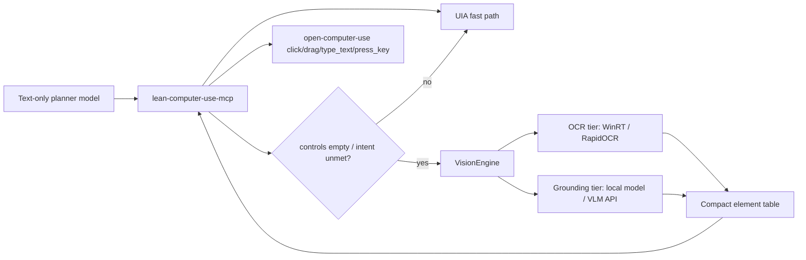

# Vision Engine Design

Status: design for M2. This document specifies how the facade gains a *vision fallback*
for apps that are blind to UI Automation, so a low-cost, text-only planner model
(for example DeepSeek Flash) can still operate them.

## 1. Problem

Some desktop apps expose almost no accessibility tree. Measured on a real Windows
desktop with JianYing (CapCut):

| Signal | Result |
|---|---:|
| UI Automation tree | 1 node, 186 characters |
| Screenshot | 1944 x 1296 px, ~94k distinct colors |

A UI-Automation-only facade can see the window but cannot act on anything inside it.
The screenshot is the only useful signal, yet a text-only planner model cannot read
pixels. This is not a facade bug; it is an upstream runtime property.

Goal: when the UIA route fails, run the screenshot through an external *vision engine*
(OCR and/or grounding model) and return a **compact text element table** that the
planner model can reason about. The planner never receives the raw image.

## 2. Verified upstream coordinate actions (Windows, open-computer-use 0.3.1)

Probed the real Windows runtime via MCP `tools/list` and empty-argument errors:

| Tool | Coordinate support | Notes |
|---|---|---|
| `click` | `x`, `y` (screenshot pixel coordinates) | Requires `get_app_state` first; supports `mouse_button`, `click_method` |
| `drag` | `from_x/from_y/to_x/to_y` (all required) | Fully coordinate-driven, no element needed |
| `type_text` | no element required | `{"app", "text"}` only |
| `press_key` | no element required | xdotool syntax, e.g. `Up`, `Tab`, `ctrl+c` |
| `scroll` | **not supported** | Requires `element_index`; vision-only route must use drag/keyboard workarounds |
| `get_app_state` | - | Must be called once per app before action tools; matches the facade `state_id` protocol |

Windows `click_method` notes from the upstream schema: `auto`, `accessibility`,
`app_post` are supported; `sky_click` and `global` are **not** supported on Windows.
`accessibility` requires `element_index`; coordinate clicks use `auto` or `app_post`.

Conclusion: the standard "screenshot -> coordinates" loop is executable end to end
today. The only gap is `scroll`, which has three workarounds: drag the scrollbar,
click inside the scroll area then press arrow keys, or click a discovered scroll
button.

## 3. Survey: open-source approaches

| Project | What it does | Why it matters | Cost / runtime |
|---|---|---|---|
| Microsoft **OmniParser V2** + **OmniTool** | Screen parser: YOLOv9-E icon detection + Florence-2 icon description + OCR; OmniTool = parser -> any vision model (GPT-4o, Qwen2.5-VL, DeepSeek R1, Claude) -> Windows action service | Closest architecture to this design: parse first, plan with a cheap model, execute coordinates | GPU recommended, CPU possible; ScreenSpot Pro SOTA 39.5% |
| ByteDance **UI-TARS** | Native GUI-agent VLM: perception, reasoning, grounding in one model | `UI-TARS-2B-SFT` runs locally; UI-TARS-2 paper arXiv:2509.02544 | 2B quantized feasible on consumer GPU |
| Microsoft **UFO / UFO2** | Windows agent: **UIA + visual Set-of-Marks hybrid**; HostAgent + AppAgent; speculative multi-actions (-51% LLM calls) | Validates "UIA first, vision fallback" exactly; RAG knowledge base for unknown apps | Needs API keys; paper arXiv:2504.14603 |
| **ZonUI-3B**, **GUI-Owl-1.5-8B**, **InfiGUI-G1-7B**, **UI-TARS-2B-SFT** | Small GUI-grounding models (icon/button localization) | Optional local grounding layer for privacy or offline | 3-8B, GPU |
| **screen-ocr (WinRT)** / **RapidOCR** | Local OCR: WinRT (Windows.Media.Ocr) or PP-OCRv5 ONNX | Fastest first tier for Chinese text (JianYing menus are mostly text) | CPU, <15MB for RapidOCR |
| Agent S2 | Screenshot-only agent, mixture-of-grounding (arXiv:2504.00906) | Pure-vision navigation evidence | API |
| CogAgent (Tsinghua, CVPR24) | 1120x1120 dual-encoder screen VLM | High-resolution screenshot understanding | 18B, GPU |
| ScreenAI (Google) | Screen understanding + grounding VLM (arXiv:2402.04615) | Grounding vocabulary for UI elements | API/GPU |
| AppAgent (Tencent) | Exploration phase then deployment | Self-learning UI maps, not needed for M2 | API |
| OpenAdapt-ML | Record trajectories -> fine-tune agents | Future: task-specific fine-tuning from user demos | GPU |

**What we borrow:** OmniTool's pipeline shape (parse -> plan -> execute), UFO's
UIA+vision hybrid trigger, OmniParser's compact element-table output format, and
WinRT/RapidOCR for the cheapest OCR tier. Windows OCR backend install:
  `pip install screen-ocr[winrt] winrt-windows-globalization` (no GPU needed;
  requires the Windows Chinese OCR language pack).

## 4. Survey: closed-source approaches

| Product | Mechanism | Interface we must match |
|---|---|---|
| OpenAI **computer-use-preview** | Screenshot pixels -> predicted position/action sequence; docs explicitly support a **custom harness mixing vision with programmatic interaction** | Emit coordinates/actions a planner can execute |
| Anthropic **Computer Use** | Screenshot -> click coordinates in `display_width_px/display_height_px` space; docs recommend downsampling screenshots before sending | Same "screenshot -> x/y" contract; coordinate space must be documented |

Both closed systems converge on the same interface: **screenshot in, coordinates out**.
That is the de-facto industry contract, and it is exactly what upstream `click`/`drag`
already accept. Our facade keeps the planner model text-only and treats the vision
engine as a swappable backend (local OCR, local grounding model, or any OpenAI-
compatible multimodal API).

## 5. Recommended architecture



### Fallback rules (in order)

1. `cu_observe` returns the UIA element table as today.
2. If the tree is empty/trivial (<= 2 controls) **or** the intent matches no control,
   the facade may run the OCR tier on the cached screenshot.
3. If OCR alone cannot satisfy the intent (icons, buttons without labels), the facade
   may run the grounding tier. **Auto-escalation (implemented):** in `vision=auto`
   mode, when the base engine returns fewer than `LEAN_CU_VISION_UPGRADE_MIN_ELEMENTS`
   elements (default 3), the facade escalates to `LEAN_CU_VISION_UPGRADE_ENGINE`
   (default `none`; set to `llm`) with the intent as the grounding hint. Escalation is
   throttled to once per `LEAN_CU_VISION_UPGRADE_COOLDOWN_SECONDS` (default 60) per
   process; suppressed attempts (cooldown or unavailable engine) keep the base table
   and are reported in the `upgrade` field of the vision response.
   the facade may run the OCR tier on the cached screenshot.
3. If OCR alone cannot satisfy the intent (icons, buttons without labels), the facade
   may run the grounding tier.
4. Results are merged into one compact table: `role, text, bbox (x,y,w,h), confidence`.
5. The planner picks elements or raw coordinates; `cu_act` gains `x`/`y` (and drag
   endpoints) and executes through upstream with the same `state_id` freshness gate.

### Contract: compact element table

```json
{
  "engine": "rapidocr",
  "image_size": {"width": 1944, "height": 1296},
  "image_bytes": 94210,
  "latency_ms": 180,
  "elements": [
    {"role": "text", "text": "Export", "frame": {"x": 1820, "y": 24, "width": 44, "height": 28}, "confidence": 0.96}
  ]
}
```

Rules:

- Elements are **text-only**; no image is returned to the planner in `controls` mode.
- `image_bytes` and `latency_ms` are always reported so cost stays measurable.
- Element `frame` is in the same screenshot pixel space that `cu_observe` uses and
  that upstream `click` expects; no rescaling ambiguity.
- Confidence below a configurable threshold (default 0.5) is dropped for OCR; the
  grounding tier reports its own confidence and the same threshold applies.

### Metrics contract (adds to `cu_metrics`)

| Field | Meaning |
|---|---|
| `vision_calls` | Number of vision-engine invocations (OCR or LLM) |
| `vision_image_bytes` | Total screenshot bytes sent to a vision backend |
| `vision_latency_ms` | Total vision-engine time |
| `vision_elements` | Total elements produced |
| `vision_upgrades` | Escalations to the upgrade engine that ran in this call (0/1) |
| `vision_upgrade_calls` | Summary aggregate of `vision_upgrades` across calls |
| `vision_engine` | Engine name of the last call |

Every change that touches token cost keeps the existing assertion: text characters,
image bytes, node count. Vision additions must also assert `vision_*` counters.

## 6. Security and privacy

- Screenshots stay on disk in the local image cache; a remote vision backend is used
  only if explicitly configured (`LEAN_CU_VISION_ENGINE` / API endpoint), never by
  default.
- Vision output is untrusted data exactly like UIA text: it can never override
  protocol rules (AGENTS.md safety).
- Coordinate actions are content-level actions and follow the existing confirmation
  policy of the skill layer; the facade never manufactures confirmation.
- No personal data or real accessibility trees are committed; fixtures stay sanitized.

## 7. Milestones

- **V1 (done)**: `vision/` package with engine interface, WinRT + RapidOCR
  adapters, fake engine, config field, unit tests. No server behavior change.
- **V2 (code done, content action pending user confirmation)**: `cu_act` accepts
  `x`/`y` (click) and `drag`; `cu_observe` triggers WinRT OCR fallback on empty trees
  (`vision=auto|on|off`); PROTOCOL/SECURITY/BENCHMARKS updated; real JianYing run
  verified: 40 OCR elements in ~200ms, ~97.7% model-visible context reduction
  (screenshot stays local). A coordinate click on the real window still needs user
  confirmation before execution.
- **V3 (done)**: OpenAI-compatible multimodal API client (`engine="llm"`) with screenshot downscale (max 1568px, JPEG 85) and automatic coordinate rescaling; `vision=auto` now escalates OCR -> LLM when the OCR table is thin, throttled by cooldown (`LEAN_CU_VISION_UPGRADE_*`). Configure via `LEAN_CU_VISION_ENGINE=llm` plus `LEAN_CU_VISION_API_BASE` / `_API_KEY` / `_MODEL`, or keep OCR as the first tier with `LEAN_CU_VISION_UPGRADE_ENGINE=llm`.
  client (`engine="llm"`) with screenshot downscale (max 1568px, JPEG 85) and
  automatic coordinate rescaling back to the original screenshot space. Configure
  via `LEAN_CU_VISION_ENGINE=llm` plus `LEAN_CU_VISION_API_BASE` / `_API_KEY` /
  `_MODEL`. Local OCR remains the default first tier; `llm` engages when OCR alone
  cannot satisfy the intent (icons, semantics).
- **V4 (benchmarks)**: JianYing-style scenarios in `benchmarks/` comparing UIA-only
  vs UIA+vision success rate and context cost.

## 8. Open decisions (need user input)

- Vision backend preference: local OCR only (privacy, free) vs cloud VLM API
  (accuracy) vs both layered.
- Whether a remote API key is available for the grounding tier.
- GPU availability for local grounding models.
